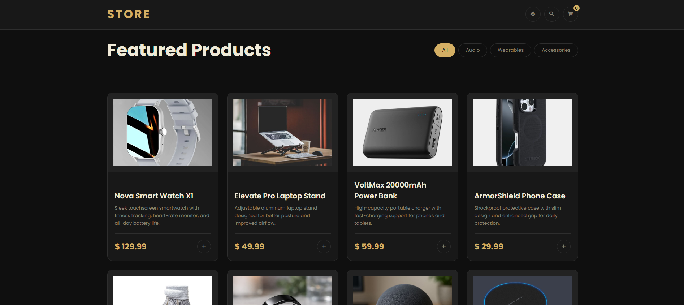

# 🛍️ Store — Product Page

A simple e-commerce product page built with vanilla HTML, CSS, and JavaScript.

## ✨ Features

- Browse products with category filtering (All, Audio, Wearables, Accessories)
- Search products by name or description
- Add products to cart
- Increase / decrease item quantity in cart
- Remove items from cart
- Live total price calculation
- Cart item count badge
- Light / Dark mode toggle
- Responsive design for mobile and desktop

## 🛠️ Technologies Used

- HTML
- CSS
- JavaScript (Vanilla)


## 🚀 How to Run

No installation needed. Just follow these steps:

1. Clone the repository:

```
git clone https://github.com/maaz-afzal/product-page.git
```

2. Go into the project folder:

```
cd product-page
```

3. Open `index.html` in your browser and you are good to go.

## 🌐 Live Demo

[View Live Demo](https://maaz-afzal.github.io/product-page)
